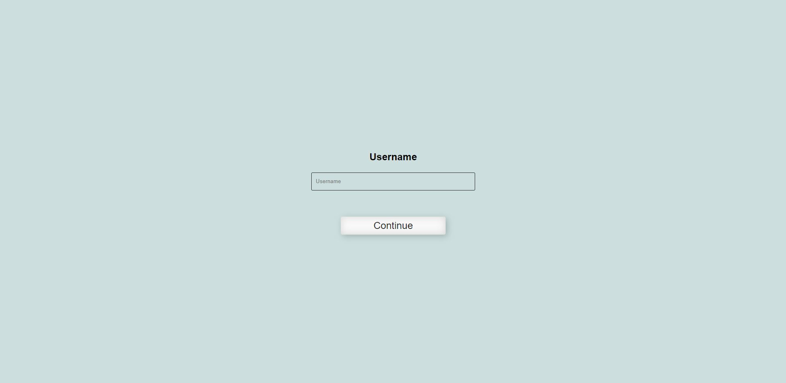
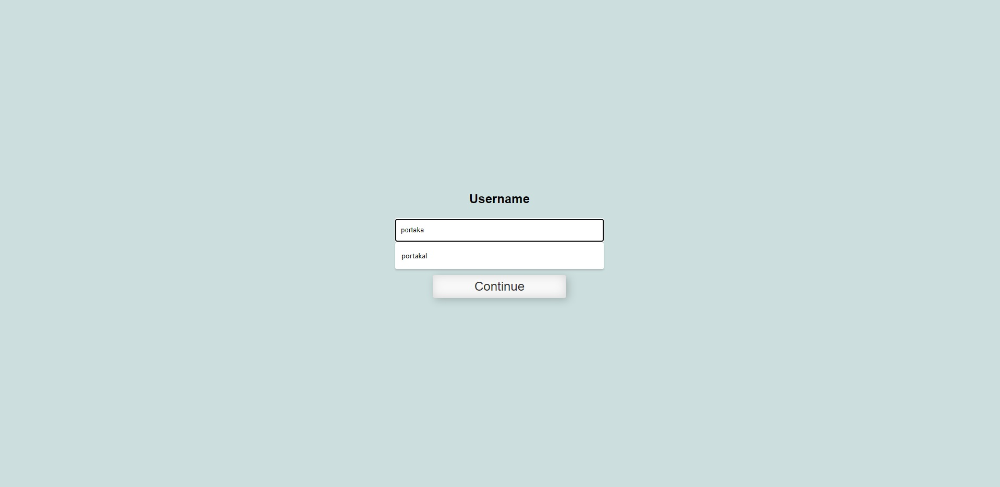
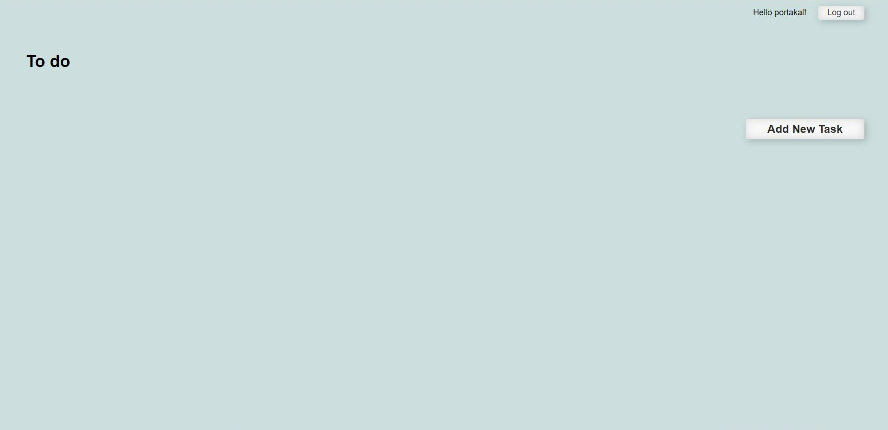
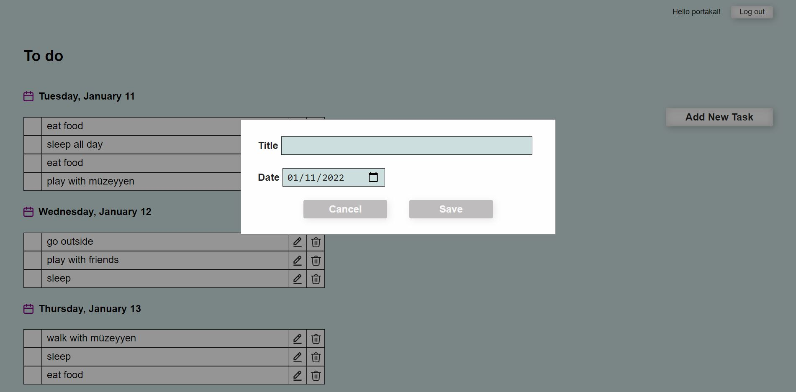
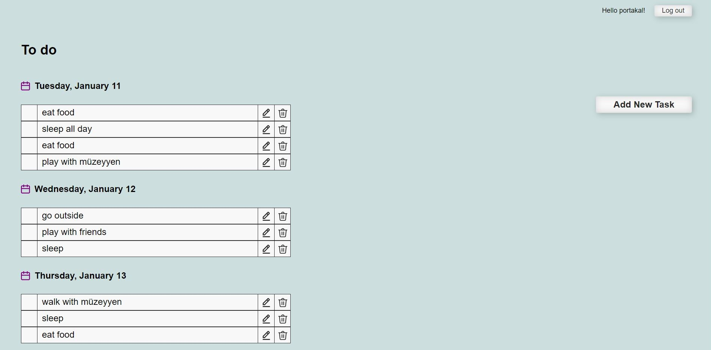
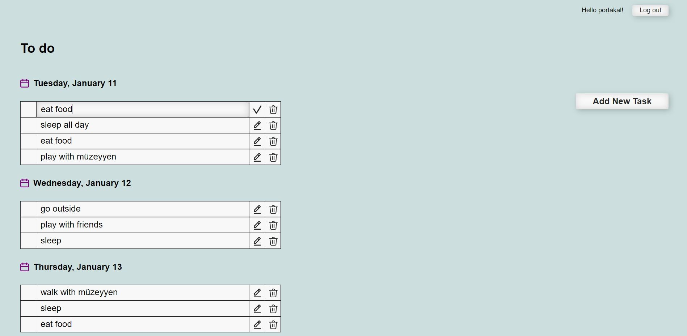
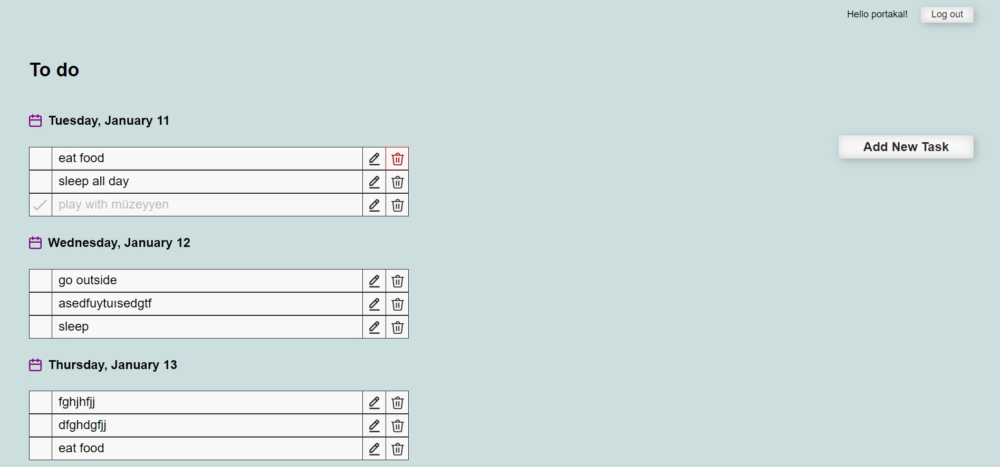
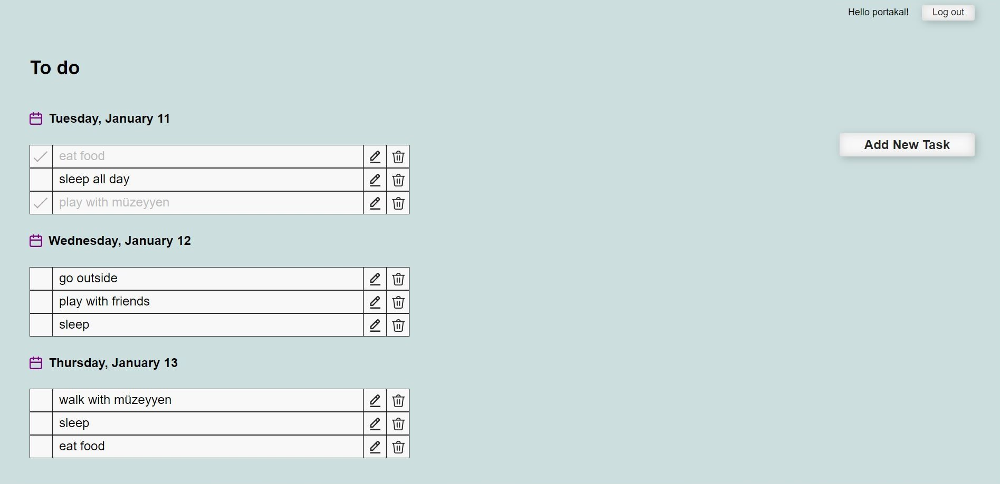

# TodoAppByVanillaJS
To do app was created by Vanilla Javascript

## Features
- Vanilla Javascript
- Vanilla CSS
- Local Storage (HTML5)

## How to do app works?

- App has two main pages:
    - Login page
    - To do list page

- Login page has a form to enter username
- Username is saved in local storage 
- Current user is saved in local storage
- Also username and users todo list is saved in local storage
- Todo list page has tree part 
    - To do list 
    - Add New Task button 
    - Logout button
- User login firs time, the app will show a welcome message and see empty to do list
- User can add new todo if he/she click Add New Task button
- You should chose a date for todo
- Todo List can be sorted by date
- User can delete todo if he/she click delete button
- User can edit todo if he/she click edit button
- User can mark todo as done if he/she click checkbox
- User can logout if he/she click logout button
- User can see his/her todo list if he/she login again because the app will save the todo list in local storage

##### Login page

##### Todo list page

##### You see portakal's todo list (my cat)
See you!

